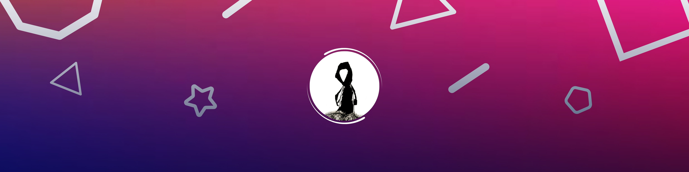

  

  

  

<h3 align = "center">I am currently a Year 3 Cybersecurity student, studying in Ngee Ann Polytechnic</h3>

  
  <a href="https://www.linkedin.com/in/jun-wei-tan">
    

  

<h2 align = "center">$ ls skills_tools</h2> 

  <a href="https://skillicons.dev">
    

 

<h2 align='center'>$ ls stats</h2> 

  
  

